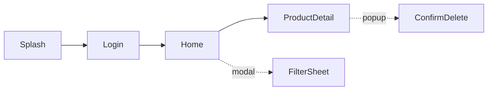

# Mẫu `docs/screen-map.md`

Tạo file theo đúng khung dưới đây. Giữ tên screen ổn định để tìm bằng grep hoặc Ctrl+F. Ảnh chụp lưu ở `docs/screens/<TênScreen>.png`.

````markdown
# Screen Map

> Cập nhật lần cuối: <YYYY-MM-DD> · Stack: React Native (+ ReactJS nếu có)

## 1. Sơ đồ điều hướng



Ký hiệu: mũi tên liền là điều hướng thường, mũi tên đứt là modal, bottom sheet hoặc popup.

## 2. Bảng tra cứu theo screen

| Screen | Loại | File chính | Component con | State/Store/Hook | API/Service | Mở từ | Đi tới | Figma | Ảnh |
|---|---|---|---|---|---|---|---|---|---|
| Login | screen | `src/screens/Login/index.tsx` | `PhoneInput`, `OtpForm` | `useAuthStore` | `POST /auth/login` | Splash | Home | <link> | `screens/Login.png` |
| FilterSheet | bottom sheet | `src/components/FilterSheet.tsx` | `PriceSlider` | `useFilterStore` | không | Home | (đóng) | <link> | chưa chụp được: cần dữ liệu |

Giá trị cột "Loại": `screen`, `modal`, `bottom sheet`, `popup`.
Cột "Ảnh": đường dẫn tương đối từ `docs/`, hoặc `chưa chụp` / `chưa chụp được: <lý do>`.

## 3. Thư viện ảnh

| Login | Home |
|---|---|
|  |  |

## 4. Web (ReactJS), chỉ tạo khi dự án có phần web
Bảng cùng cấu trúc, tách riêng khỏi mobile.

## 5. Ghi chú
- Screen chưa có Figma, chưa chụp được ảnh hoặc chưa rõ luồng: ghi vào đây.
````
